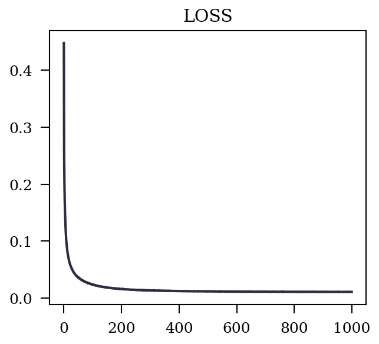
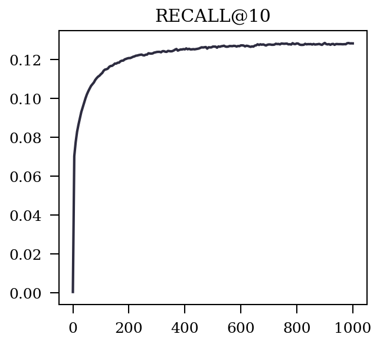
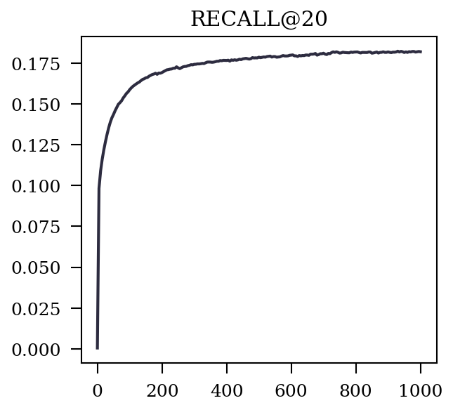
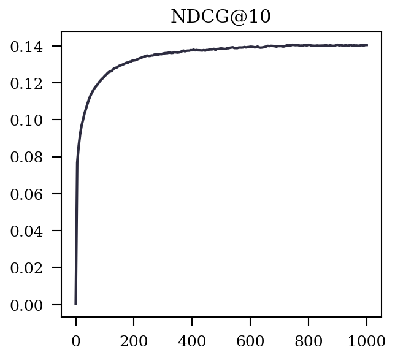
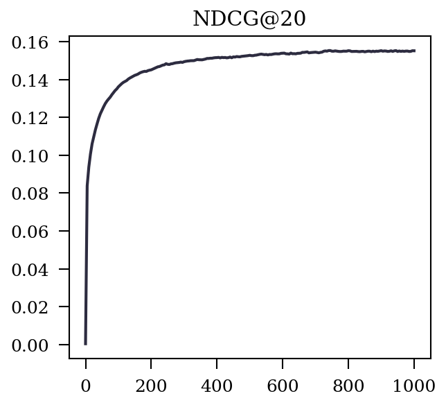
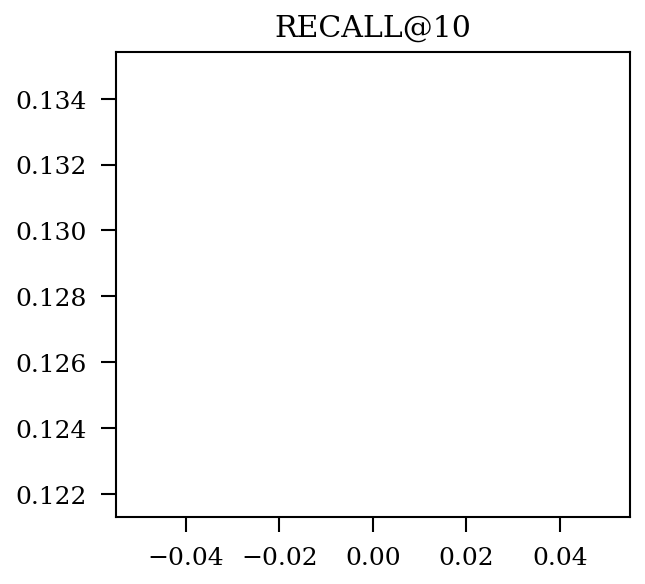
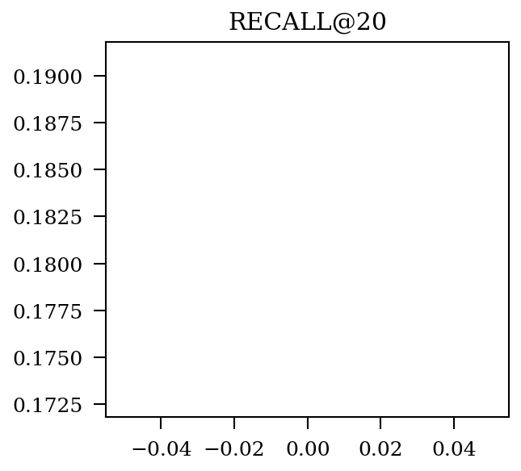
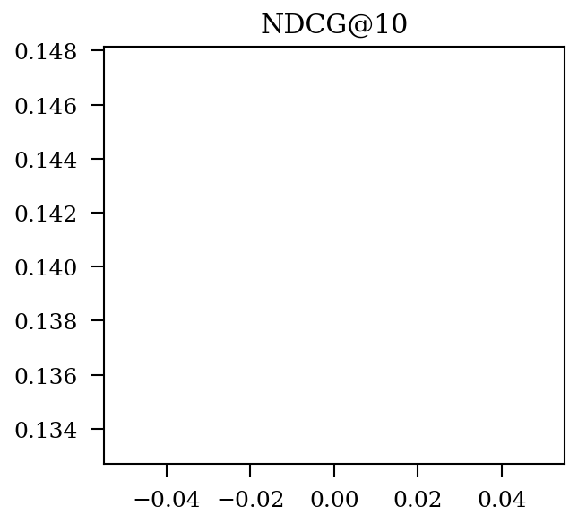
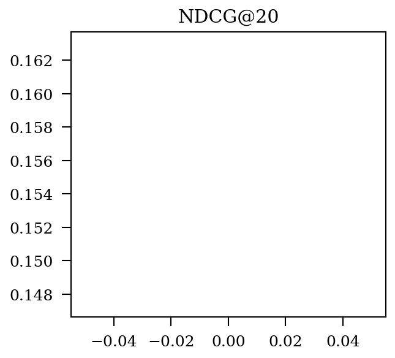

|  Prefix  |   Metric   |   Best   |   @Epoch   |   Img   |
| :-------: | :-------: | :-------: | :-------: | :-------: |
|  train  |   LOSS   |   0.010547816560144408   |   973   |      |
|  valid  |   LOSS   |   -1   |   -1   |      |
|  valid  |   RECALL@10   |   0.1286031332849394   |   900   |      |
|  valid  |   RECALL@20   |   0.1821605319768476   |   930   |      |
|  valid  |   NDCG@10   |   0.14057117977459502   |   745   |      |
|  valid  |   NDCG@20   |   0.15528888372389102   |   745   |      |
|  test  |   LOSS   |   -1   |   -1   |      |
|  test  |   RECALL@10   |   0.12836290669262357   |   0   |      |
|  test  |   RECALL@20   |   0.18181839857495743   |   0   |      |
|  test  |   NDCG@10   |   0.14042918643490518   |   0   |      |
|  test  |   NDCG@20   |   0.15516971557248468   |   0   |      |
