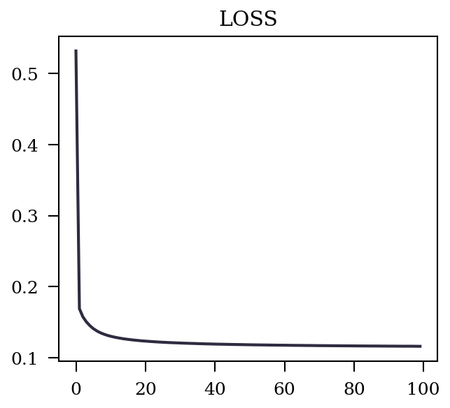
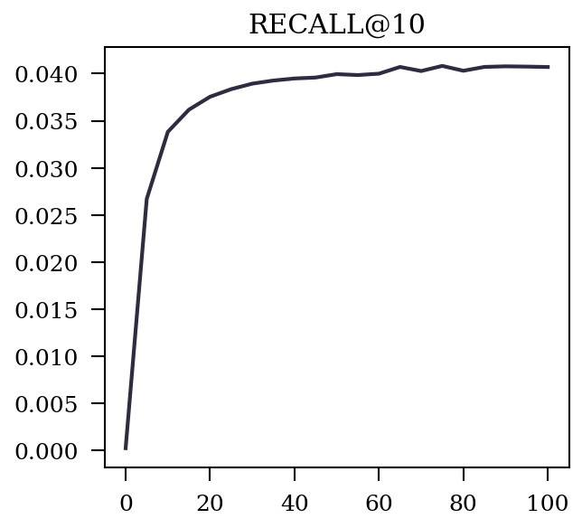
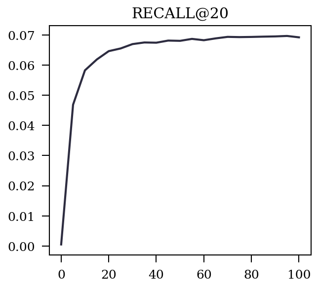
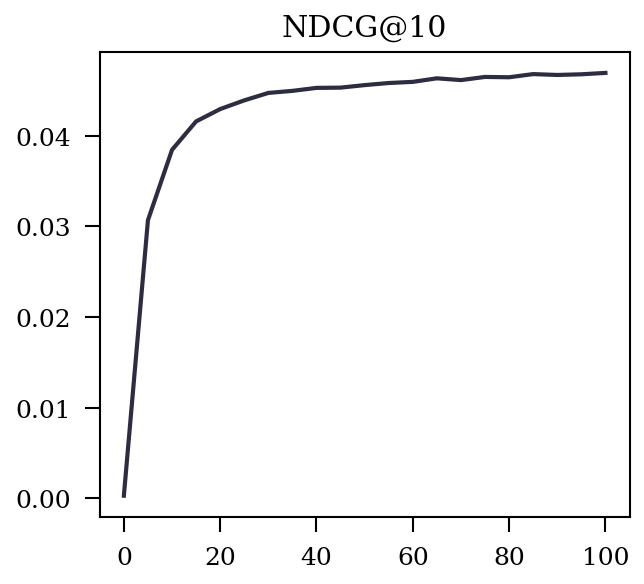
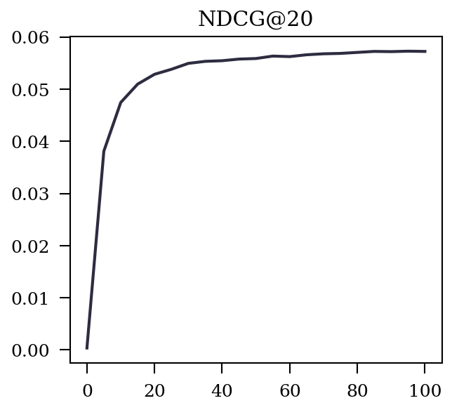
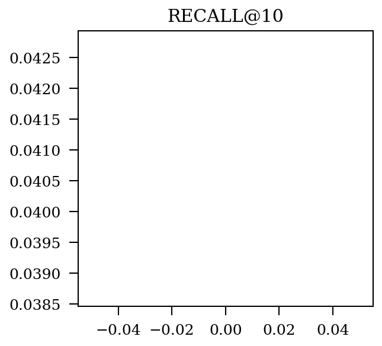
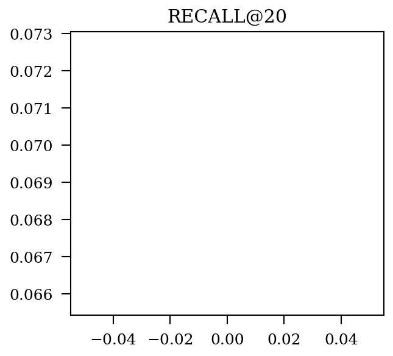
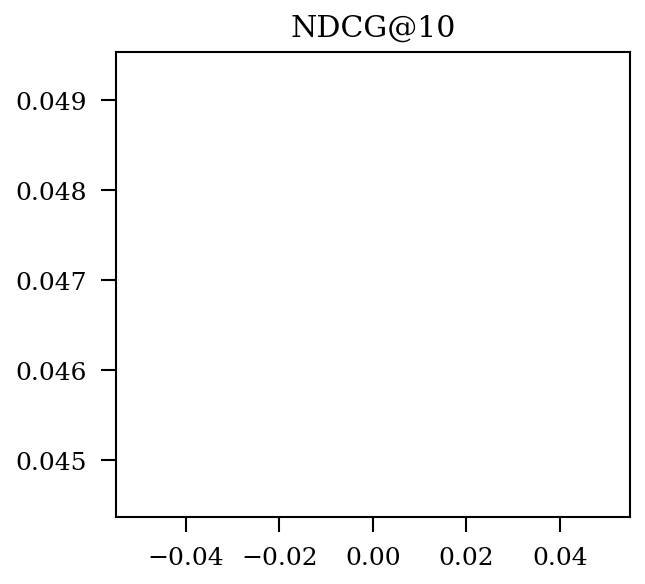
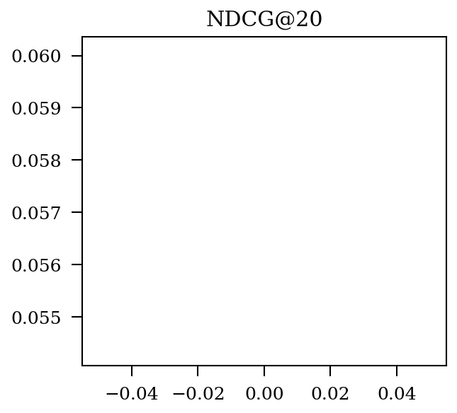

|  Prefix  |   Metric   |   Best   |   @Epoch   |   Img   |
| :-------: | :-------: | :-------: | :-------: | :-------: |
|  train  |   LOSS   |   0.11604787871367077   |   99   |      |
|  valid  |   RECALL@10   |   0.04081485168107094   |   75   |      |
|  valid  |   RECALL@20   |   0.06970321819666893   |   95   |      |
|  valid  |   NDCG@10   |   0.04695062092956035   |   100   |      |
|  valid  |   NDCG@20   |   0.057262777260714964   |   95   |      |
|  test  |   RECALL@10   |   0.040699134430577676   |   0   |      |
|  test  |   RECALL@20   |   0.06924428544457882   |   0   |      |
|  test  |   NDCG@10   |   0.04695062092956035   |   0   |      |
|  test  |   NDCG@20   |   0.05721506278120702   |   0   |      |
