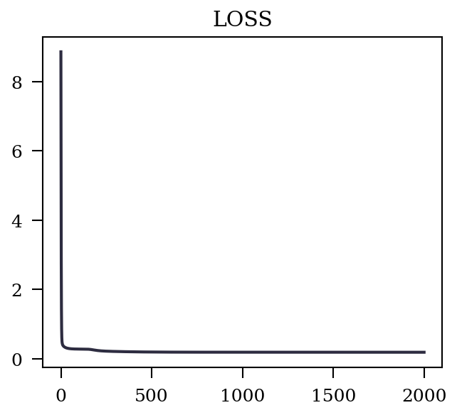
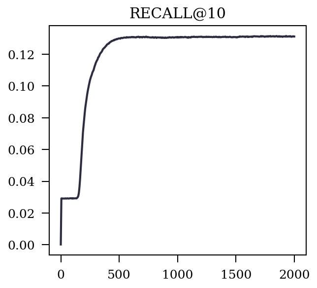
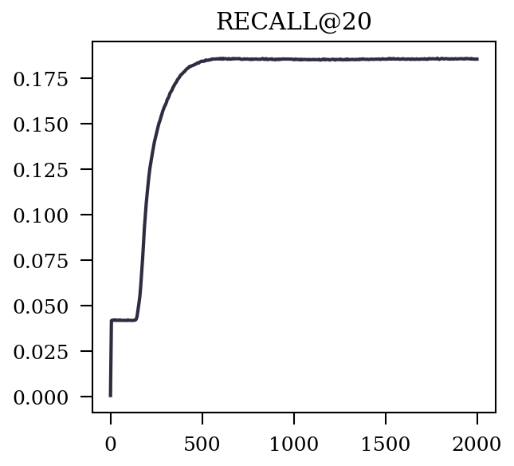
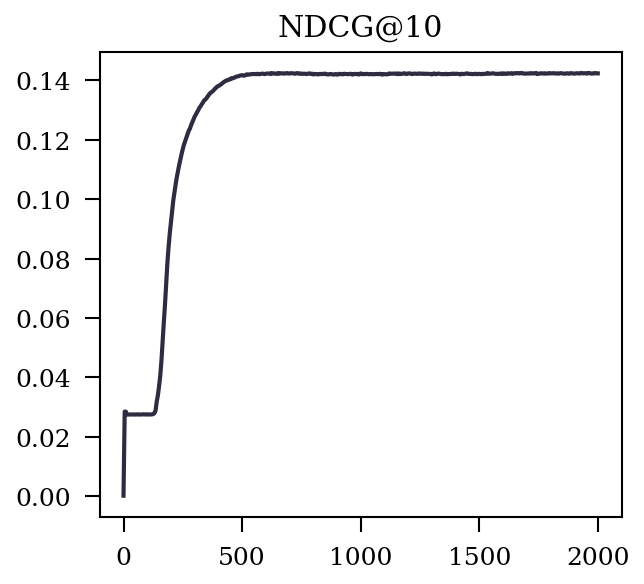
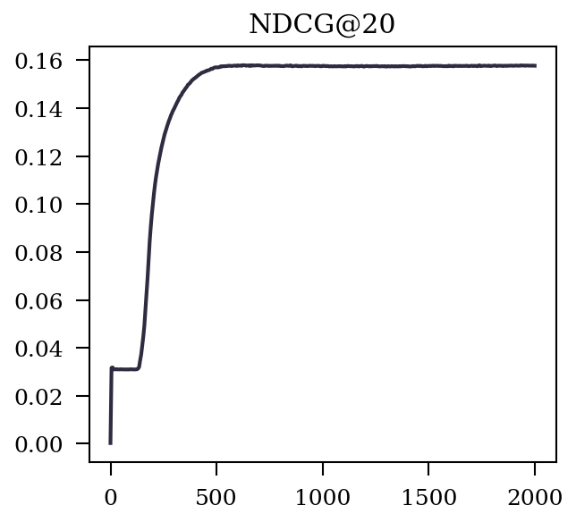
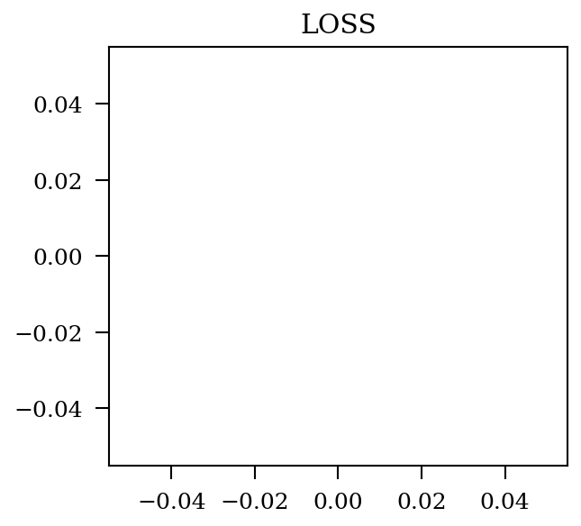
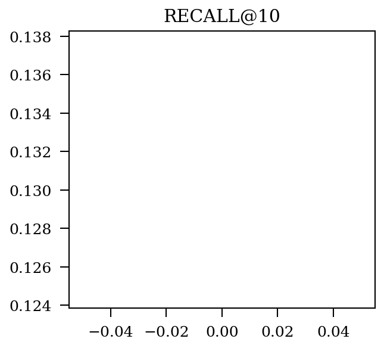
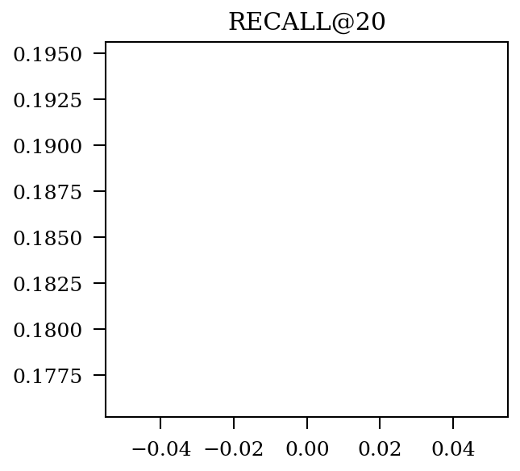
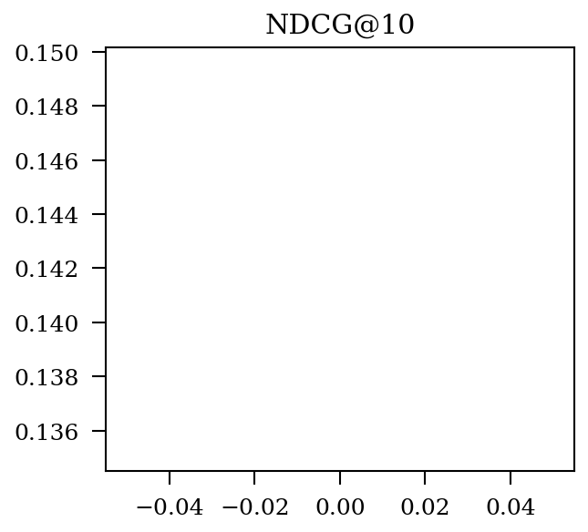

|  Prefix  |   Metric   |   Best   |   @Epoch   |   Img   |
| :-------: | :-------: | :-------: | :-------: | :-------: |
|  train  |   LOSS   |   0.18706514453368328   |   1989   |      |
|  valid  |   LOSS   |   -1   |   -1   |      |
|  valid  |   RECALL@10   |   0.1314199489785084   |   1930   |      |
|  valid  |   RECALL@20   |   0.18594993826984296   |   1785   |      |
|  valid  |   NDCG@10   |   0.1425038127469293   |   1930   |      |
|  valid  |   NDCG@20   |   0.15795046935202695   |   625   |      |
|  test  |   LOSS   |   -1   |   -1   |      |
|  test  |   RECALL@10   |   0.13106588190946106   |   0   |      |
|  test  |   RECALL@20   |   0.1854457945755477   |   0   |      |
|  test  |   NDCG@10   |   0.14234240142151566   |   0   |      |
|  test  |   NDCG@20   |   0.1577080975843934   |   0   |      |
